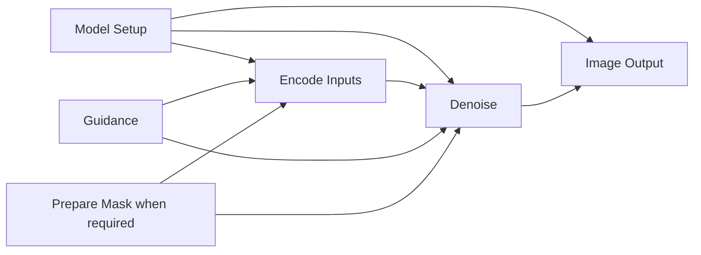

# Simpler image workflows: MoDiff and Mellon

MoDiff can offer a canvas as easy to follow as Mellon's common image examples
while keeping its wider task coverage, editable stages and execution safeguards.
The useful direction is a small set of task-oriented stages, ordinary expandable
groups and fewer component wires. Model-specific loading and tensor conventions
still need backend adapters. A five-node picture alone does not establish either
model compatibility or a simpler editing experience.

The current paired implementation already moves all 54 image templates onto
ordinary operation authoring. It groups relevant encoders as **Encode Inputs**
and presents a real consumed guider as **Guidance**. Explicit **Model Setup**,
**Prepare Mask** and **Image Output** actions now group eligible ordinary stages
without changing template defaults. The component-bundle facade below is a
separate, opt-in Qwen text-to-image improvement that retains the same ownership
and cache rules. See [component bundle authoring](component-bundle-authoring.md).

## Inspection scope and evidence

The comparison uses the real Mellon frontend source, not an interpretation of
the minified frontend bundled in its backend:

| Repository | Inspected immutable commit | Relevant source |
| --- | --- | --- |
| Mellon backend | `5fd242921d13bff9fb03f4de405fdd39c2335e1f` | [Supplied image graph][mellon-t2i], [model loader][mellon-loader], [encoding][mellon-encoding], [denoising][mellon-denoise], [family configuration][mellon-config] |
| Mellon frontend | `af0c5801f843453a1700733596e99fe6589b2e86` | [Canvas and wiring][mellon-workflow], [schema-driven fields][mellon-fields], [graph store and grouping][mellon-flow], [graph library][mellon-graphs], [Run request][mellon-run] |

Mellon was inspected read-only. No Mellon application, model or dependency
installation was run. Its node/wire counts are measurements of supplied JSON,
and its execution observations below are source observations. They are not
runtime performance, image-quality or usability-test results.

MoDiff descriptions refer to the paired backend/client implementation accompanying
this guide. The main source is the backend [operation contracts](../modiff/operation_contracts.py),
[starter resolver](../modiff/operation_starters.py), and the client
[template selections](https://github.com/sdevil7th/MoDiff-client/blob/fix-ui-ux-issues/src/studio/templateOperationSelections.ts),
[template builder](https://github.com/sdevil7th/MoDiff-client/blob/fix-ui-ux-issues/src/studio/templateOperationWorkflow.ts),
[visual groups](https://github.com/sdevil7th/MoDiff-client/blob/fix-ui-ux-issues/src/workflow/visualOperationGroups.ts), and
[operation adaptation](https://github.com/sdevil7th/MoDiff-client/blob/fix-ui-ux-issues/src/workflow/operationAuthoring.ts).
Use [image template validation](image-template-validation.md) for actual old/new
output evidence and [large image model validation](large-image-model-validation.md)
for the separate coverage and resource boundaries. Existing successful runs
retain their recorded scope; an unfinished broader acceptance gate does not
erase them or qualify other routes.

## What makes the Mellon example compact

Mellon's supplied Modular text-to-image graph has five nodes and seven wires:
**Models Loader → Encode Prompt → Denoise → Decode Latents → Preview Image**.
The loader supplies several component handles; encoding packages the relevant
`denoiser_input_fields` into one embeddings output. Denoise accepts that bundle.
The graph therefore shows a few stages without showing every conditioning tensor
as an independent connection. See the [graph JSON][mellon-t2i] and the
[encoder implementation][mellon-encoding].

Its frontend also avoids bespoke editors for every model. [NodeContent][mellon-fields]
selects widgets from declared display/type/options, reads the stored value with
its default fallback, and supports hidden fields and declared UI groups. The
[canvas][mellon-workflow] lets a wire dropped on an editable field turn that field
into an input. Socket search filters by direction and nominal type and inserts
the first matching handle. This makes small graphs quick to assemble, although
nominal type matching does not establish model, conditioning or component-role
compatibility.

Mellon's generic nodes still depend on per-family `MellonPipelineConfig`
declarations, model-type signals and selected upstream blocks. Adding a Hub model
does not automatically make every task supported. The inspected Modular
configuration does not declare a universal built-in mask/inpaint/outpaint path;
that observation does not claim the whole Mellon application has no such support.
See [family configuration][mellon-config].

The JSON measurements also show that Mellon's examples are not uniformly five
nodes:

| Supplied Mellon graph | Nodes | Wires |
| --- | ---: | ---: |
| Modular text to image | 5 | 7 |
| Modular image to image | 7 | 10 |
| Modular multiple-image edit | 7 | 10 |
| Modular quantization | 6 | 8 |
| Dynamic node example | 3 | 2 |
| FLUX Kontext Nunchaku | 8 | 9 |
| SD3 Float8 | 6 | 7 |

These counts come from `len(graph.nodes)` and `len(graph.edges)` in the
[supplied graph directory][mellon-graph-directory]. They count authored canvas
objects, not the number of upstream model calls.

## What MoDiff has already simplified

Fresh image templates now use the same backend-resolved operation starter,
graph transaction, node fields, readiness checks and Run export as ordinary
developer authoring. They retain exact execution-profile identity and creator
prompts, seeds, sizes, settings, model revisions and media roles. Opening a saved
workflow preserves that graph. This behavior is documented in the client
[image template workflow guide](https://github.com/sdevil7th/MoDiff-client/blob/fix-ui-ux-issues/docs/image-template-workflows.md).

Of the 54 recipes, 48 have real native loading, input encoding, denoising and
latent decoding. The four Qwen masked-edit/outpaint recipes use the reviewed
native compatibility path described in [image validation](image-template-validation.md).
Six keep their explicit whole-pipeline task boundary: two FLUX Fill, two FLUX
Canny/Depth and two FLUX Redux. Those six do not receive decorative encoding or
Guidance nodes. A native replacement requires parity with the exact selected
task, artifact and recipe.

Encode Inputs groups the encoders required by the selected operation. Guidance
groups an actual guider, including a singleton guider where appropriate. These
are ordinary Block V2 instances with editable underlying nodes and real crossing
connections. Their visible shells are presentation; the exported effective graph
retains the actual backend calls. See [visualOperationGroups.ts](https://github.com/sdevil7th/MoDiff-client/blob/fix-ui-ux-issues/src/workflow/visualOperationGroups.ts)
and the [composite contract](composite-node-contract.md).

The measured current distribution is:

| Visible nodes in a fresh image template | Number of templates |
| ---: | ---: |
| 5 | 1 |
| 6 | 21 |
| 7 | 17 |
| 8 | 13 |
| 9 | 2 |
| **Total** | **54** |

Thus 38 of 54 templates have six or seven visible nodes; the median is seven.
Representative exported workflow packages contain:

| Current MoDiff template | Visible nodes | Graph wires | Visible stages |
| --- | ---: | ---: | --- |
| `flux_schnell_text_to_image` | 6 | 11 | Load Models, Encode Inputs, Guidance, Denoise, Decode Latents, Preview Image |
| `qwen_edit_plus_single_image` | 7 | 15 | The native stages plus Load Image |
| `qwen_control_image_layout` | 9 | 16 | The native stages plus Load Image, ControlNet and an auxiliary Load Model |

The procedure counts `workflowPackage.graph.nodes` and `.graph.edges`. Each
collapsed visual group counts once; its `blockInstanceV2` children are not added
again. The wires are the package's graph-level connections, not flattened API
edges. [Creator contracts](https://github.com/sdevil7th/MoDiff-client/blob/fix-ui-ux-issues/tests/fixtures/image-template-creator-contracts.v1.json)
and [template operation tests](https://github.com/sdevil7th/MoDiff-client/blob/fix-ui-ux-issues/scripts/template-operation-workflows.test.mjs)
provide the public recipe inventory and builder checks.

Mellon's supplied five-node example and MoDiff's six-node Schnell template are
different selected models and recipes. The count comparison identifies visible
complexity, not a controlled same-model benchmark. MoDiff's extra guider also
expresses a meaningful shared encoding/denoising policy. Removing it merely to
match five nodes could change the recipe.

## Compare the complete authoring journey

| Action | Inspected Mellon behavior | Current MoDiff behavior and useful next step |
| --- | --- | --- |
| Start | Search backend graph files and drag a saved graph onto the canvas; insert raw nodes from the registry. | Choose a task to create a connected backend-resolved starter, or choose a creator template with its exact recipe. Keep this one entry path. |
| Set fields | Registry metadata chooses generic widgets; input conversion and hidden/UI-group fields reduce clutter. | Ordinary scalar inputs keep a literal editor and optional socket. A wire supplies execution and disables the literal editor; disconnect restores its saved fallback. Optional stage groups expose the existing leaf controls and sockets through Block V2. |
| Connect | Socket search and insertion match direction and nominal type; a target input has one supplier. | Validate nominal types plus declared semantic role, scope and model ownership. Reduce repetitive wires without weakening these checks. |
| Change model | Model signals refresh dynamic fields; matching handle names can retain connections. | Resolve an exact backend starter; preserve compatible authored values and unrelated branches, preview incompatible changes, then commit atomically with Undo/Redo. Keep reviewed defaults separate from authored values. |
| Group | The store contains parent-rectangle grouping helpers and API export excludes group objects; no caller exposing an equivalent expandable reusable group UI was found in the inspected frontend. | Block V2 exposes real ports/controls, nested content and reusable snapshots. Proposed compact stages must use this existing contract. |
| Save/share | Canvas JSON and API JSON are distinct exports; backend graph files are browseable. | Saved workflow documents, portable packages and effective API export retain identities and embedded Block snapshots. A simpler view must round-trip the same document. |
| Run/edit | Export follows upstream dependencies from selected targets; Run posts the graph to the backend. | Submit the same effective graph that the canvas edits, with required-media, model, resource and ownership checks. Keep selected-output/Block scope and unrelated drafts separate. |
| Stop/reconnect | Frontend retry/backoff and queue/loop state exist; inspected Modular step-preview callback is commented out. | Retain actual denoising progress/cancellation, durable tasks, guarded socket recovery and backend readiness probes. A smaller canvas must still explain active work and terminal failures. |

Sources: Mellon's [GraphList][mellon-graphs], [Workflow][mellon-workflow],
[TopBar][mellon-topbar], [flow store][mellon-flow], [Run][mellon-run] and
[websocket store][mellon-websocket]; MoDiff's
[workflow authoring guide](workflow-authoring-ux.md),
[connection matching](https://github.com/sdevil7th/MoDiff-client/blob/fix-ui-ux-issues/src/workflow/nodeConnectionMatching.ts),
[transaction](https://github.com/sdevil7th/MoDiff-client/blob/fix-ui-ux-issues/src/workflow/operationGraphTransaction.ts), and
[websocket store](https://github.com/sdevil7th/MoDiff-client/blob/fix-ui-ux-issues/src/stores/useWebsocketStore.ts).

## Keep the capabilities, simplify their presentation

A compact default view should retain these capabilities:

| Capability | Required preservation |
| --- | --- |
| Model and component replacement | Exact repository/revision/profile, meaningful component roles, explicit independent replacements and unchanged unrelated owners. |
| Prompt and conditioning edits | Positive/negative prompts, ordered references, image/control conditioning, layer/task-specific inputs and actual guider behavior. |
| Sampling controls | Seed and fresh per-run generator state, scheduler/configuration, inference steps, dimensions, batch and strength only where consumed. |
| LoRA and auxiliary models | Immutable adapter identities, order, names and scales; ControlNet/IP-Adapter/prior contracts; optional branches without duplicate hidden loaders. |
| Masks and outpainting | Source bytes, alpha/mask interpretation, geometry, placement, feathering, task-specific canvas preparation and editable intermediate outputs. |
| Outputs | Preview, Save Image, grids, comparison, optional upscaling and independent output branches. |
| Resource choices | Automatic/Custom memory selection, dtype, quantization, offload, attention/VAE policy, runtime readiness and actionable failures. |
| Reuse and extension | Nested Blocks, Save as User Node, interface configuration, custom reviewed sources, import/export, Undo/Redo and old saved graphs. |

Keeping these features does not require showing every expert field or every
component wire on the initial canvas. It does require retaining access to them
and showing required inputs and incompatible edits clearly.

## Generic tasks need specific backend contracts

Use stable task names such as Load Models, Encode Inputs, Denoise, Decode Latents,
Prepare Mask and Image Output. The client should render the backend's declared
ports, editable fields, bounds, conditional requirements, defaults and operation
decomposition. A new model should ordinarily add a reviewed backend adapter and
execution specification, rather than a model-named node or frontend branch.

This is functional genericity: a task has a common purpose and authoring surface,
while its backend adapter declares its actual requirements. Qwen instruction
editing, ordinary image-to-image diffusion, FLUX Fill, ControlNet and reference
editing are not interchangeable because they all accept an image. Different
tokenizers, latent layouts, mask conventions, guidance meanings and precision
boundaries remain explicit. See [ordinary image adapters](../modules/DiffusersImage/main.py),
[native Modular adapters](../modules/ModularDiffusers/native_blocks.py), and
[operation semantics](../modiff/operation_contracts.py).

The existing starter resolver is the right place to choose a reviewed route.
Model selection should continue to prefer a compatible remembered selection or
available reviewed route and leave an empty required model field when none
qualifies. Discovery must not load weights or install packages. Arbitrary Hub
repositories and remote Python are not automatically admitted by a generic label.

### Guidance meanings are declared

Backend v3 operation contracts now declare reviewed distilled guidance, true CFG,
normalized Qwen CFG and their policy dependencies as additive control semantics.
The client transfers explicitly compatible values and retains unresolved or
incompatible values for review. It still does not infer equivalence from a label.
See [guidance control transfer](guidance-control-transfer.md).

The runtime already has real distinctions. A shared MoDiff guider feeds both
encoding and denoising so unconditional conditioning agrees with the denoising
policy. Mellon's inspected EncodePrompt has no guider input, while its Denoise
node accepts a guider; this is a source-level interface difference, not a runtime
claim that Mellon's outputs are wrong. See its [encoding][mellon-encoding] and
[denoising][mellon-denoise] declarations. Converted FLUX Dev/Krea/Kontext templates preserve true CFG separately
from the embedded distilled scale; Schnell keeps true CFG disabled. Converted
Z-Image templates preserve the old pipeline's enabled original formulation while
ordinary developer starters keep their declared disabled policy. These are
recipe differences, not a universal meaning for a field called Guidance.
See [template guidance policy](https://github.com/sdevil7th/MoDiff-client/blob/fix-ui-ux-issues/src/studio/templateOperationWorkflow.ts),
[encoding](../modules/ModularDiffusers/embeddings.py), and
[image template validation](image-template-validation.md#preserve-the-recipe-before-changing-the-graph).

The declarations name guidance technique, enabled state, formulation, scale
meaning, negative-conditioning requirement and compatibility scope. Unknown
runtime model configuration still cannot authorize cross-model transfer. An
unchanged model/executor preserves existing values and wires. Other switches
show retained values and target defaults before commit. Old snapshots keep their
existing execution unless the user applies a reviewed change.

## Optional ordinary groups and breakout behavior

Workflow stage actions assemble eligible ordinary nodes using the same Block V2
machinery as Encode Inputs. They are explicit authoring edits; opening a saved
graph or a template does not rewrite it:

| Group | Current eligibility and behavior | Expanded ordinary contents |
| --- | --- | --- |
| **Model Setup** (`ModelSetup`) | A real loader with connected built-in adapter/configuration nodes. Model and task controls continue through ordinary operation authoring. A bare loader stays ordinary. | Existing Load Models and connected configuration or LoRA nodes; individual outputs remain available by expansion/separation. |
| **Prepare Mask** (`PrepareMask`) | A task-correct Outpaint Canvas supplying both the image and mask to the same declared consumer, with its image source. A standalone mask loader stays ordinary. | Existing image loading and Prepare Outpaint Canvas, preserving placement, overlap, feathering and fill. |
| **Image Output** (`ImageOutput`) | A declared native decoder directly supplying Preview Image. A whole-operation preview stays ordinary. No Save operation is inserted. | Existing Decode Latents and Preview Image; custom output branches retain their connections. |

There is already an [OutpaintCanvas implementation](../modules/DiffusersImage/main.py)
and ordinary [image utilities](../modules/Image/main.py) and
[image processing](../modules/ImageOperations/main.py). A Prepare Mask group must
choose a task-correct recipe rather than introduce one mask preprocessing rule
for every family. Image Output must not silently add saving, overwrite files or
change the original preview branch merely because it is a convenient shell.

Users should be able to expand a group to inspect/edit its real contents, expose
an internal component socket, replace a supplier, separate ordinary stages, or
save their edited subtree as a reusable Block. Expansion/collapse only changes
presentation. Separating/regrouping is an explicit atomic graph edit that preserves
effective values, exact source identities, external connections and unrelated
branches. Neither operation overwrites a saved library definition.

An illustrative compact native text-to-image view can have five visible stages,
including the actual Guidance owner. Combining decoding and preview inside Image
Output reduces the current six-stage view while preserving both underlying cache
boundaries:

This is an illustrative shape, not a universal executable recipe. A whole-pipeline
route still needs its actual Generate/Edit operation instead of invented native
stages. Tasks without masks omit Prepare Mask; a recipe without a consumed guider
omits Guidance. Explicit ControlNet/prior/reference operations remain available.

### Fewer wires through a reviewed component bundle

MoDiff's ModelsLoader already publishes `pipeline_components` with type
`diffusers_modular_pipeline_components`, alongside individual text-encoder,
denoiser, VAE and scheduler outputs. See [loader output declarations](../modules/ModularDiffusers/loaders.py).
The reviewed opt-in Qwen text-to-image facade uses that existing output for
Encode Prompt, Denoise and Decode Latents. It reduces four component edges to
three. Other families and tasks keep their individual or existing whole-workflow
contracts; one generic type does not authorize substitution everywhere.

The backend-declared optional input carries exact owner/generation identity and
named component roles. Its temporary projections retain the same loader token
and managed IDs, while explicit breakout restores ordinary wires. Consumers
validate demanded roles and residency before execution/cache reuse. A consumer
with competing individual suppliers is left ordinary by authoring. Shared
conditioning bundles such as ControlNet remain distinct from this component set.

Visual groups separately change presentation while preserving real leaf inputs.
Both paths use the current executor and component manager. Neither selects
ambient components, duplicates a loader or creates a second hidden pipeline.
The prototype's one-wire reduction is deliberately modest; widening it requires
reviewed per-task contracts and evidence rather than a universal bundle claim.

## Where fields and cached state should live

| Field or state | Owner in the simpler view | Execution/persistence rule |
| --- | --- | --- |
| Model/revision/profile, dtype/offload/quantization | Model Setup's existing loader and declared configuration nodes. | Exact backend identity remains authoritative; group controls bind to those fields. |
| Prompt, negative prompt, references | Encode Inputs and explicit media suppliers. | Literal fallback persists; connected values win. Hide a control only as presentation, retain its value and binding. |
| True CFG/guider policy | Guidance where actually consumed. | One shared policy reaches encoding and denoising; distilled guidance remains separately identified. |
| Seed, steps, scheduler, size, strength | The actual consuming stage or its deliberately exposed group control. | Avoid duplicate literals overwriting computed dimensions or strength-adjusted steps. |
| Mask/canvas choices | Prepare Mask's ordinary utility nodes. | Cache deterministic preparation separately and preserve exact source and geometry. |
| Preview and saving | Image Output's existing terminal nodes. | Match previews to their task/media identity; saving remains an explicit behavior. |
| Resident components and compute outputs | Existing backend cache owners. | Group shells do not own an additional runtime cache or change release lifetimes. |

Both applications already reuse loaded components and node results. Mellon looks
up compatible component `load_id`/dtype/quantization before loading and passes
component IDs through its manager. MoDiff additionally guards device, offload,
runtime and disk-hook ownership, snapshots mutable inputs and implementation
identity, handles valid optional `None`, and invalidates affected descendants on
eviction. See Mellon's [loader][mellon-loader] and [NodeBase][mellon-nodebase],
and MoDiff's [loader](../modules/ModularDiffusers/loaders.py),
[cache identity](../modiff/node_cache_identity.py), and
[execution/cache path](../modiff/server.py).

Expected reuse should remain understandable: an unchanged rerun can reuse outputs;
a seed edit normally retains model loading and prompt encoding; a prompt edit
retains models but invalidates relevant conditioning and descendants; model,
adapter or resource-policy changes can require reloading. These are dependency
expectations, subject to the actual route and cache policy, not a promise that
every Run performs inference. A seeded mutable generator must be fresh per graph
execution while sharing intentionally within that run.

No simplification should change stored defaults merely to make the interface
smaller. Apply new presentation to newly authored graphs first. Opening an old
workflow is read-only with respect to its semantics. Explicit adaptation must
preserve compatible authored values and show conflicts before committing through
the [existing transaction](https://github.com/sdevil7th/MoDiff-client/blob/fix-ui-ux-issues/src/workflow/operationGraphTransaction.ts).

## Implemented scope and further acceptance

| Priority | Current scope and next work | Validation to retain when extending scope |
| --- | --- | --- |
| 1 | Preserve the implemented ordinary-template foundation. Keep exact selections, Encode Inputs and consumed Guidance; retain explicit whole-pipeline exceptions. | All 54 creator contracts preserve prompts, inputs, seeds, defaults and exact identities; interactive creation and harness use the same builder; save/reload, Undo/Redo, stale asynchronous edits and required-media failures pass. Keep actual old/new output evidence separate. |
| 2 | Implemented reviewed true CFG/distilled guidance declarations and safe scalar transfer. Additional model-dependent predicates need their own evidence. | Shared client/backend fixtures reject unsafe transfers; compatible values survive model switches; incompatible guidance uses a visible preview; disabled guidance and negative encoding agree; historical recipes remain unchanged. |
| 3 | Implemented explicit Model Setup, Prepare Mask and Image Output actions for the eligible stages described above. Broader task eligibility remains separate work. | Native click/drag creation, expand/collapse, internal edit, breakout, external connections, nested Save as User Node, reinsert and refresh preserve API export and execution scope. Required input errors name the actual stage. Ordinary utilities remain discoverable. |
| 4 | Implemented the opt-in Qwen text-to-image component facade. Additional families require reviewed backend declarations and actual task evidence. | Compare grouped/ungrouped and facade/breakout effective inputs; reject wrong roles/owners/stale component generations; prove no duplicate load, stale ambient component or altered cache lifetime. Measure fewer visible wires and fewer manual actions. |
| 5 | The four Qwen masked templates now use the native compatibility path after full original output and ordinary Auto comparisons. Expand other decomposition only where exact task parity is established. | For each of the six whole-pipeline exceptions, inspect the pinned upstream route, preserve preprocessing/generator/guidance/precision, run actual matched outputs and retain failures. Keep the whole-pipeline route until that route's acceptance passes. |

Use the existing [template contract tests](https://github.com/sdevil7th/MoDiff-client/blob/fix-ui-ux-issues/scripts/template-operation-workflows.test.mjs),
[operation authoring checks](https://github.com/sdevil7th/MoDiff-client/tree/fix-ui-ux-issues/scripts),
[browser journeys](https://github.com/sdevil7th/MoDiff-client/blob/fix-ui-ux-issues/tests/e2e/studio-mocked/studio-mocked.spec.ts),
backend [tests](../tests), and paired repository gates in
[CONTRIBUTING](../CONTRIBUTING.md). Documentation work does not rerun or replace
those gates. For implementation, first add a focused failing regression, then
test the shared change and affected browser lifecycle. Real-model checks must
retain exact source/runtime/settings, output bytes and visual assessment under
the [validation procedure](image-template-validation.md).

Measure simplification with representative same-model workflows: start from
empty, enter/edit a prompt, connect required media, select/change a model, expose
an expert component, run, save and reopen. Record visible stages/wires, manual
connections, dialogs and actions needed, plus preserved consumed values. Include
plain text-to-image, single/multiple-reference edit, ControlNet and masked/outpaint
recipes. Node count is one metric; an extra stage that makes an important policy
editable can improve the workflow.

[mellon-t2i]: https://github.com/cubiq/Mellon/blob/5fd242921d13bff9fb03f4de405fdd39c2335e1f/data/graphs/modular_diffusers/text_to_image.json
[mellon-graph-directory]: https://github.com/cubiq/Mellon/tree/5fd242921d13bff9fb03f4de405fdd39c2335e1f/data/graphs
[mellon-loader]: https://github.com/cubiq/Mellon/blob/5fd242921d13bff9fb03f4de405fdd39c2335e1f/modules/ModularDiffusers/loaders.py#L474-L718
[mellon-encoding]: https://github.com/cubiq/Mellon/blob/5fd242921d13bff9fb03f4de405fdd39c2335e1f/modules/ModularDiffusers/embeddings.py#L74-L158
[mellon-denoise]: https://github.com/cubiq/Mellon/blob/5fd242921d13bff9fb03f4de405fdd39c2335e1f/modules/ModularDiffusers/denoise.py#L104-L221
[mellon-config]: https://github.com/cubiq/Mellon/blob/5fd242921d13bff9fb03f4de405fdd39c2335e1f/modules/ModularDiffusers/modular_utils.py
[mellon-nodebase]: https://github.com/cubiq/Mellon/blob/5fd242921d13bff9fb03f4de405fdd39c2335e1f/mellon/NodeBase.py
[mellon-workflow]: https://github.com/cubiq/Mellon-client/blob/af0c5801f843453a1700733596e99fe6589b2e86/src/components/Workflow.tsx#L225-L285
[mellon-fields]: https://github.com/cubiq/Mellon-client/blob/af0c5801f843453a1700733596e99fe6589b2e86/src/components/NodeContent.tsx#L74-L197
[mellon-flow]: https://github.com/cubiq/Mellon-client/blob/af0c5801f843453a1700733596e99fe6589b2e86/src/stores/useFlowStore.ts
[mellon-graphs]: https://github.com/cubiq/Mellon-client/blob/af0c5801f843453a1700733596e99fe6589b2e86/src/components/GraphList.tsx
[mellon-topbar]: https://github.com/cubiq/Mellon-client/blob/af0c5801f843453a1700733596e99fe6589b2e86/src/components/TopBar.tsx
[mellon-run]: https://github.com/cubiq/Mellon-client/blob/af0c5801f843453a1700733596e99fe6589b2e86/src/utils/runGraph.ts
[mellon-websocket]: https://github.com/cubiq/Mellon-client/blob/af0c5801f843453a1700733596e99fe6589b2e86/src/stores/useWebsocketStore.ts
